<p align="center">
  <picture>
    <source media="(prefers-color-scheme: dark)" srcset="docs/assets/logo-dark.svg" />
    
  </picture>
</p>

<p align="center">
  A local-first AI memory system with a multi-agent backbone and a visual knowledge graph.
</p>


---

## What is Loom?

Loom is a personal knowledge system that stores everything as **plain Markdown** on your disk and uses a **team of AI agents** to keep it organized. Notes connect via `[[wikilinks]]`, and a **force-directed graph** lets you see your mind at a glance.

You write captures; agents do the structuring, linking, summarizing, and validating. The whole stack runs locally — your files, your provider keys, your machine.

> **New here?** The [Getting Started guide](docs/getting-started.md) walks you from install through onboarding, the four views, and the capture → note → graph loop.

## Why Loom?

- **Local-first.** Notes live as readable Markdown in `~/.loom/vaults/`. No lock-in, no cloud sync, no proprietary database.
- **Multi-agent, not single-prompt.** Seven specialized agents in two tiers (Loom Layer manages the vault; Shuttle Layer produces content) — plus any custom agents you add — collaborate via a shared *read-before-write* discipline.
- **Visual by default.** A `Sigma.js` + `graphology` canvas shows your notes as a living network — drag, zoom, filter by type or tag.
- **Provider-agnostic.** Plug in OpenAI, Anthropic, xAI, OpenRouter, or a local Ollama model. Chat and embedding providers are independent, and every model call is recorded as an inspectable trace.

## Architecture at a glance

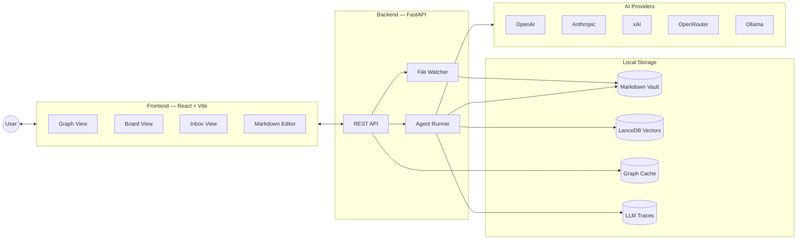

The backend reads and writes the vault on disk; the frontend renders it. The agent runner orchestrates AI calls; the file watcher keeps the index fresh when notes change outside the UI.

## The two-tier agent system

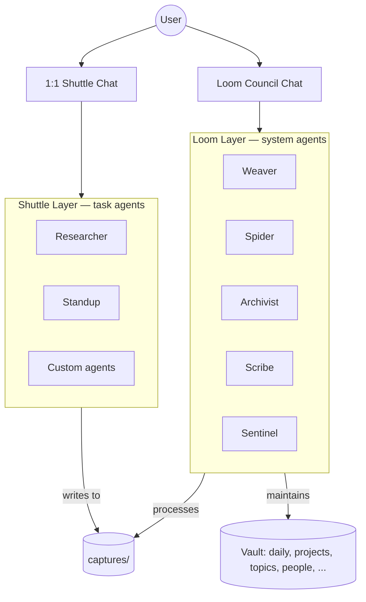

**Loom Layer** agents manage the vault. You speak to them collectively via the **Loom Council** — a transparent multi-agent thread where each one chimes in by role.

**Shuttle Layer** agents are task-driven; you chat with them one-on-one. They never write into the main vault — they drop output into `captures/`, and the Loom Layer takes it from there. You can also define your own custom Shuttle-tier agents from the Board; the seven built-ins below stay read-only.

### Agent reference

| Agent | Tier | Role |
|---|---|---|
| **Weaver** | Loom | Converts raw captures into structured notes with YAML frontmatter. |
| **Spider** | Loom | Finds semantic connections and maintains bidirectional `[[wikilinks]]`. |
| **Archivist** | Loom | Audits the vault — flags stale notes, broken links, missing metadata. |
| **Scribe** | Loom | Writes folder `_index.md` files and daily logs. |
| **Sentinel** | Loom | Validates every agent action against `prime.md` rules and schemas. |
| **Researcher** | Shuttle | Answers questions by searching the vault and citing source notes. |
| **Standup** | Shuttle | Generates scheduled daily recaps from vault activity and an optional read-only calendar feed. |

## Read-before-write

Every agent follows the same chain before performing any mutation. This keeps the vault internally consistent and gives `prime.md` (your constitution) real authority.

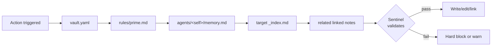

Hard block on failure by default; trusted agents can be configured for soft-warn.

## How it works

### From capture to note

A raw capture never becomes a note in one step. Weaver classifies and formats it, Sentinel validates the result against `prime.md` and the matching schema, the note is written to disk, and Spider connects it to the rest of the vault. The inbox lets you `preview` this whole chain as a dry run before you `commit`.

Capture producers all use one ingress service. Manual/API captures, Researcher,
Standup, custom agents, and Calendar receive the same provenance validation,
external-ID deduplication, indexing, durable job creation, and live-update events.
The Inbox exposes Active, Review, and History job views; queued work and terminal
outcomes survive restarts.

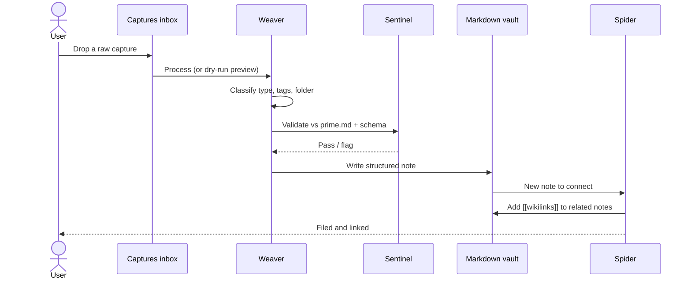

### Council chat, streamed

When you ask the Loom Council a question, the backend fans the prompt out to all five system agents (capped at three concurrent calls so a single turn doesn't blow a free model's rate limit). Each agent's take arrives as one `contributions` event, then an aggregator distils them into a single voice that streams back token by token over Server-Sent Events. The final `done` frame carries a `trace_id` so you can open the raw model call.

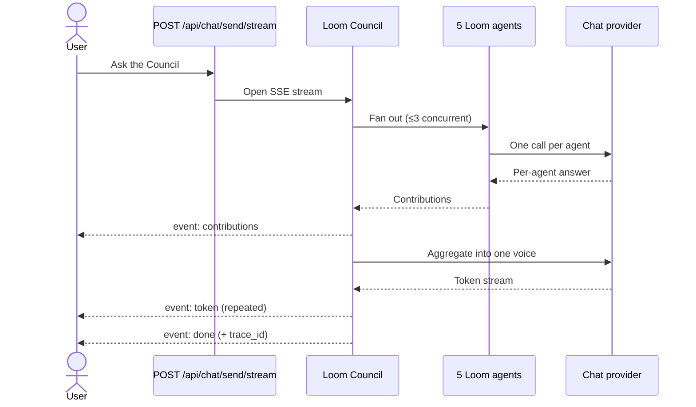

### Providers, and every call traced

All five providers sit behind one registry. Chat and embedding providers are resolved independently, and every provider is wrapped in a `TracedProvider` that records each exchange — provider, model, messages, response, duration — into a 500-entry in-memory ring that also mirrors to disk by date. Each trace is also tagged with the `run` and `step` it belongs to, so a multi-step agent run (e.g. the capture pipeline: `weaver → spider → scribe → sentinel → enforce`) shows up as one connected run in the **Runs** view, not a scattered list of calls. The "raw call" link anywhere in the UI reads straight from `/api/traces`; the Runs view reads `/api/traces/runs`.

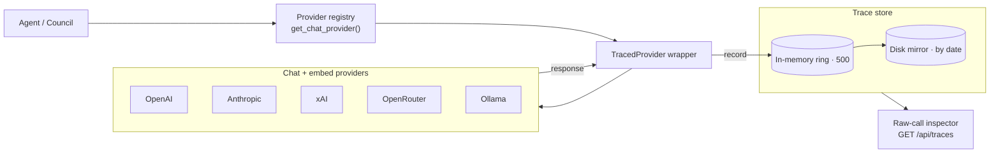

### Hybrid search

Search blends three signals: semantic similarity from LanceDB vectors, plain keyword matching with tag/type filters, and a graph-aware boost that lifts notes already linked to strong hits. When no embedding provider is configured, it degrades gracefully to keyword-only.

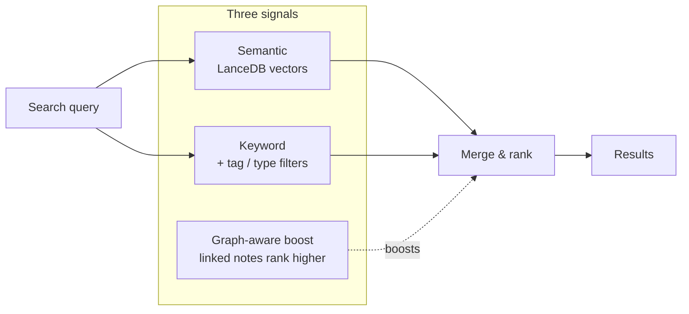

## Features

### Knowledge graph
- Force-directed Sigma.js 3 + graphology layout with drag, zoom, pan
- Orbit mode: focus-first concentric scenes around a selected node (rings / spiral / arms / galaxy / wave)
- Edge travelers: little dashes animate along edges so the graph reads as alive, not static
- Display panel: tune label size & density, node size, spacing, edge thickness, breathing, and travelers — persisted to `localStorage` with one-click reset
- Hover highlights neighbors; edge thickness scales with link density
- Filter by note type or tag; click-to-select syncs with the file tree
- ETags + `Last-Modified` for cheap refresh

### Vault & notes
- Multi-vault filesystem at `~/.loom/vaults/`
- Fixed core folders (`daily`, `projects`, `topics`, `people`, `captures`) plus your own
- Atomic Markdown writes with YAML frontmatter (`id`, `title`, `type`, `tags`, `created`, `modified`, `author`, `status`, `history`)
- Edit history tracked per-mutation in frontmatter
- Deletion = move to `.archive/`, never destroyed
- File watcher reflects external edits live

### Search
- Hybrid: semantic (LanceDB vectors) + keyword + tag/type filters
- Graph-aware boosting — linked notes rank higher
- Keyword fallback when no embedding provider is configured
- Global search bar (Cmd/Ctrl+K) plus a separate file-tree filter

### Agents & chat
- Loom Council chat streams its answer token-by-token over SSE, with each agent's contribution shown as its own bubble
- Every model call is captured as a trace — open the "raw call" on any message to see provider, model, prompt, response, and latency
- Custom agents: spin up your own Shuttle-tier agent from the Board; the seven built-in agents stay read-only
- Per-agent `memory.md` summarized every 20 actions
- Per-agent-per-day changelog at `.loom/changelog/<agent>/<date>.md`
- Chat history persisted as Markdown: `agents/_council/chat/` for Council, `agents/<name>/chat/` for Shuttle
- Captures inbox view for triaging raw input before Weaver structures it

### Providers
- OpenAI (chat + embed)
- Anthropic (chat)
- xAI / Grok (chat)
- OpenRouter (chat — including `:free` models, with rate-limit-aware retries)
- Ollama (local chat + embed)
- Chat and embedding providers configured independently

### Onboarding wizard
- First-run multi-step flow: Welcome → Vault Setup → Theme Picker → Provider Config
- Live previews for the final themes: Paper, Porcelain, Herbarium, Midnight Ink, Lagoon, and Ember
- Inline "Test connection" against the picked provider — failures don't block save
- Skip-friendly: provider step is optional, defaults pick safe models
- Onboarding state lives in `~/.loom/config.yaml` under `onboarding.completed`

## Tech stack

| Layer | Tools |
|---|---|
| Backend | Python 3.11+, FastAPI, Pydantic v2, Uvicorn |
| Agent orchestration | LangGraph (`StateGraph`) — the capture pipeline and Shuttle agents run as graphs over Loom's own providers (no LangChain provider stack) |
| Frontend | React 19, TypeScript 5.9, Vite |
| Graph | Sigma.js 3 + graphology (force-atlas2 layout) |
| Editor | Custom Markdown renderer (`frontend/src/editor/renderMarkdown.tsx`) with `[[wikilink]]` support |
| Vector DB | LanceDB + PyArrow |
| AI | OpenAI / Anthropic SDKs, `httpx` for xAI / OpenRouter / Ollama |
| Realtime | Server-Sent Events (SSE) for streamed Council replies |
| File sync | `watchdog` |
| Rate limit | `slowapi` |
| Tests | `pytest` + `pytest-asyncio` (backend), `vitest` + Testing Library (frontend) |
| Lint/format | `ruff` (Python), ESLint + Prettier (TS) |

## Quick start

### Run with Docker (one command)

The fastest way to try Loom. Builds the frontend and backend into a single
container that serves both on **one port**.

```bash
cp .env.example .env     # optional — add a provider key, or skip and use onboarding
docker compose up        # first build takes a few minutes
```

Then open **http://localhost:8000**. The onboarding wizard handles vault and
provider setup on first run.

Your notes persist in the `loom-data` Docker volume across restarts and
rebuilds. To keep them as plain Markdown files on your machine instead, swap the
volume for a bind mount (see the commented line in `docker-compose.yml`).

`docker compose up` starts only the app container. The optional Redis
(response cache) and Postgres (trace mirror) services are opt-in: run
`docker compose --profile full up` and set `LOOM_REDIS_URL` /
`LOOM_DATABASE_URL` in `.env` (ready-made values are commented in
`.env.example`). Unset, both stay disabled and Loom is byte-identical without
them.

> **Note:** Provider API keys are encrypted at rest in `config.yaml` (Fernet, under
> a machine-local master key at `~/.loom/.secret.key`) — defense-in-depth against
> casual disclosure of the config file, not a substitute for auth, and with no
> OS-keychain integration yet. If you pass a key via `.env`, keep it private — it is
> git-ignored by default.
>
> **Security:** the published port binds to `127.0.0.1` (this machine only) and the
> API ships **no auth**. Do not expose it to a LAN/internet without a reverse proxy
> + auth — see [SECURITY.md](SECURITY.md). An optional `LOOM_API_TOKEN` adds a
> shared-token speed bump for exposed ports, but it is **not** a substitute for that
> proxy — see [SECURITY.md](SECURITY.md#optional-api-token).

### Run from source (for development)

#### Prerequisites
- Python ≥ 3.11
- Node.js ≥ 18 with npm
- An API key for at least one provider (or a running Ollama instance)

#### Backend
```bash
cd backend
pip install -e ".[dev]" --break-system-packages
uvicorn api.main:app --reload --port 8000
```

#### Frontend
```bash
cd frontend
npm install
npm run dev   # serves on http://localhost:5173
```

On first run the **onboarding wizard** walks you through vault name, theme, and provider setup. The provider step is optional and can be added later from the in-app **Settings → Providers** panel (or by editing `~/.loom/config.yaml` directly). The backend reads `~/.loom/config.yaml` for global config and scaffolds a vault at `~/.loom/vaults/<name>` when the wizard completes.

### Seed an example vault
```bash
# Copy the demo vault to your local Loom directory
cp -r examples/demo-vault ~/.loom/vaults/demo
```

Then switch to it via `PUT /api/vaults/active` with `{"name": "demo"}` (or re-run the onboarding wizard with `demo` as the vault name).

## Configuration

Global config lives at `~/.loom/config.yaml`:

```yaml
active_vault: default
providers:
  default: openai
  openai:
    api_key: ${OPENAI_API_KEY}
    embed_model: text-embedding-3-small
    chat_model: gpt-4o
  anthropic:
    api_key: ${ANTHROPIC_API_KEY}
    chat_model: claude-sonnet-4-20250514
  xai:
    api_key: ${XAI_API_KEY}
    chat_model: grok-3
  openrouter:
    api_key: ${OPENROUTER_API_KEY}
    chat_model: qwen/qwen3-next-80b-a3b-instruct:free
  ollama:
    host: http://localhost:11434
    embed_model: nomic-embed-text
    chat_model: llama3
```

Per-vault config lives at `~/.loom/vaults/<name>/vault.yaml` (custom folders, agent overrides, etc).

## Project structure

```
Loom/
├── backend/
│   ├── api/              # FastAPI routers (notes, graph, search, chat, ...)
│   ├── agents/
│   │   ├── loom/         # Weaver, Spider, Archivist, Scribe, Sentinel
│   │   └── shuttle/      # Researcher, Standup
│   ├── core/             # vault, notes, config, watcher, providers, traces, exceptions
│   ├── index/            # LanceDB indexer, searcher, chunker
│   └── tests/
├── frontend/
│   ├── src/
│   │   ├── views/        # Graph, Thread, Inbox, Board, Settings, Splash, Palette
│   │   ├── components/   # AppShell, MainShell, layout/, primitives/, graph/
│   │   ├── onboarding/   # First-run wizard: Welcome, VaultSetup, ThemePicker, ProviderConfig
│   │   ├── theme/        # applyTheme, readCssVar, theme metadata
│   │   ├── context/      # AppContext + useLoomConfig (config + onboarding state)
│   │   ├── api/          # client.ts, chat.ts (SSE), traces.ts, agentsRegistry.ts, config.ts, …
│   │   ├── graph/        # sigma setup, layouts, travelers, breathing, drag handlers
│   │   ├── editor/       # markdown render + plain editing
│   │   └── styles/       # tokens.css, base.css, views/*
│   └── public/
├── docs/                 # ARCHITECTURE.md, VISION.md, architecture-ref.md, getting-started.md, style-guide.md, wireframes/
├── examples/
│   └── demo-vault/       # ready-to-use sample vault
├── scripts/              # seed and utility scripts
└── .github/workflows/    # CI
```

## API surface

The backend exposes a REST API on `:8000`. The most-used endpoints:

| Method | Endpoint | Purpose |
|---|---|---|
| `GET` | `/api/graph` | Fetch the force-directed graph (supports ETag caching) |
| `GET` | `/api/tree` | File tree |
| `GET` `POST` `PUT` `DELETE` | `/api/notes` | Note CRUD (delete = archive) |
| `GET` | `/api/search?q=...` | Hybrid search |
| `GET` `POST` | `/api/captures` | List & process captures (single or batch) |
| `GET` `POST` `DELETE` | `/api/captures/jobs` | Durable Inbox jobs, retry/cancel, and terminal-history retention |
| `GET` `PATCH` | `/api/automations/standup` | Daily Standup schedule and redacted Calendar connection state |
| `POST` | `/api/automations/calendar/test` / `/sync` | Test a read-only iCalendar feed or sync events into Inbox |
| `GET` | `/api/agents` | Agent status + action counts |
| `GET` | `/api/agents/activity` | Live per-agent activity (polled by the Pulse view) |
| `GET` `POST` `PATCH` `DELETE` | `/api/agents/registry` | List / create / edit / remove custom agents |
| `GET` | `/api/changelog?agent=&date=` | Agent changelog (per agent/date; `/api/changelog/feed` for the unified activity feed) |
| `POST` | `/api/chat/send` | Talk to a Shuttle agent or the Council |
| `POST` | `/api/chat/send/stream` | Streamed Council reply (Server-Sent Events) |
| `GET` `POST` `PUT` | `/api/vaults` | Multi-vault management |
| `GET` `POST` | `/api/settings/providers` | Provider config (keys masked on read) |
| `GET` `PATCH` | `/api/config` | Global config (theme, active vault, default provider — redacted) |
| `GET` `POST` | `/api/onboarding/status` / `/complete` | First-run wizard gate |
| `POST` | `/api/providers/{name}/test` | Test provider credentials without saving |
| `GET` | `/api/traces` | Recent LLM traces (`/api/traces/disk` pages older ones by date) |
| `GET` | `/api/traces/runs` | Multi-step agent runs, newest first (`/api/traces/runs/{id}` for one run's step timeline + per-step traces) |
| `GET` | `/api/health` / `/api/ready` | Health + readiness probes |

## Development

```bash
# Backend
ruff check backend/
ruff format backend/
pytest backend/tests/

# Frontend
cd frontend
npm run lint
npm run format
npm run test:run   # `npm run test` runs vitest in watch mode
```

CI runs on push via `.github/workflows/ci.yml`.

## Status

**1.0.0.** Loom runs end-to-end and is stable for daily local use. 1.0 is the
resilience-and-honesty milestone: the agent pipeline is observable, failures are
handled instead of swallowed, and the docs describe only what ships. It stays
deliberately local-first and unauthenticated by default — not an
internet-exposable service without your own reverse proxy (see *Known gaps*).
What works today:

- All 5 Loom Layer agents (Weaver, Spider, Archivist, Scribe, Sentinel) with the read-before-write chain
- Both Shuttle Layer agents (Researcher, Standup) plus user-defined custom agents
- Scribe daily-log generation and Sentinel AI-assisted validation (LLM path with a deterministic fallback)
- Graph, Board, Inbox, and Thread views
- Durable Inbox queue with retry/cancel, review handling, automation policy, and job history
- Scheduled Standup workspace plus encrypted read-only iCalendar connection
- First-run onboarding wizard (vault, theme, provider)
- Settings UI — appearance, providers (with key validation), vault, about/diagnostics, danger zone
- Streaming Loom Council chat with per-call trace inspection
- Multi-vault management
- Hybrid semantic + keyword search with graph-aware boosting
- Provider system (OpenAI, Anthropic, xAI, OpenRouter, Ollama)
- File watcher, rate limiting, health/readiness probes
- One-command Docker run (single container serves UI + API)

**Resilience & correctness** (the focus of recent work):
- Bounded provider retry (backoff + jitter) at the trace chokepoint — a transient blip no longer fails a whole search or index pass (OpenRouter keeps its own 429 loop)
- Index-drift detection: notes that land in the metadata index but miss the vector store are reconciled on startup, surfaced via `/api/health`, and shown as a "rebuilding" banner
- Idempotent capture pipeline — a crash between note-write and archive can't create a duplicate on retry
- One shared capture-ingress path gives every producer immediate idempotency, provenance, indexing, queue policy, and typed live events
- Vault export/import is size-bounded and disk-streamed; overwrite restores use an atomic staged swap with rollback and startup recovery
- Note archival shares the edit lock, supports optimistic version checks, and restores the exact original on a failed move
- Token-based prompt truncation (`tiktoken`, char-count fallback) so a dense note can't silently blow the context window
- End-to-end tests through the real HTTP routers (capture → process → graph → search), plus failure-path coverage for the providers/onboarding/SSE/agent routes; strict `mypy` gates CI with the type backlog at zero
- Boot-screen timeout with a Retry fallback instead of an infinite spinner; accessible confirm dialogs in place of `window.confirm`

**Known gaps (deliberate v1 boundaries):**
- **Local-first, no auth by design.** The API ships no authentication — safe on a loopback bind, not for an untrusted network. An optional `LOOM_API_TOKEN` shared-token gate adds a speed bump for a deliberately-exposed port, not access control; put real auth + TLS in a reverse proxy. See [SECURITY.md](SECURITY.md)
- **Provider API keys are encrypted at rest** in `config.yaml` (Fernet, machine-local master key) — defense-in-depth, not a substitute for auth; no OS-keychain integration yet
- **Bridge status** — the first production slice is shipped: private iCalendar feeds can enrich scheduled Standups and create idempotent Inbox jobs. Google/Outlook OAuth, GitHub, Email, the general plugin contract, the Prompt Compiler, and multi-file attachments remain planned; see [`docs/VISION.md`](docs/VISION.md)
- **Local model guidance (Ollama).** Agent work needs a model that follows note/frontmatter instructions reliably. Verified on Apple Silicon: `devstral` and `phi4` are fast and pass validation; `gpt-oss:20b` and `gemma4:26b` work but are slower (gemma4's Weaver step can approach 2 min). Reasoning models (`deepseek-r1`, thinking-mode Qwen) complete but are slow and their drafts often land in the review lane — usable, not recommended for agents. Very small instruct models may fail Sentinel's section checks; the Inbox review lane catches that safely. Chat completions stream internally, so slow-but-steady generation no longer trips the 120s read window.
- `AppContext` remains the public compatibility shell, while high-churn vault/capture loading and typed SSE refresh logic are being split into domain hooks. `useGraphInstance` remains the main graph-hook test gap.

See [`docs/ARCHITECTURE.md`](docs/ARCHITECTURE.md) for the shipped design (and [`docs/architecture-ref.md`](docs/architecture-ref.md) for the condensed version), [`docs/VISION.md`](docs/VISION.md) for the remaining Bridge adapters, Prompt Compiler, attachments, and v2+ roadmap, and [`docs/style-guide.md`](docs/style-guide.md) for conventions.

## Wireframes

Early sketches of the visual language and view models. These are *wireframes, not the final UI* — the real product renders in ink-blue + brick-red duotone on warm cream paper, with serif typography from the design language.

<p align="center">
  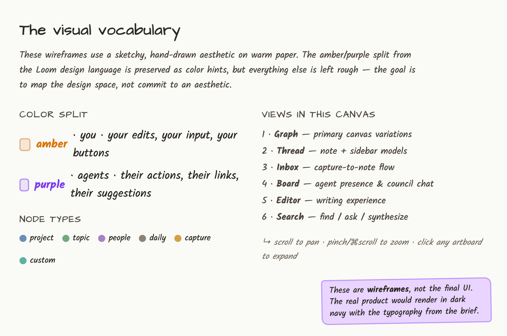
</p>

### Views

<table>
  <tr>
    <td align="center" width="50%">
      <br />
      <sub><b>Graph</b> — constellation map with type-colored nodes, hub sizing, hover-highlighted neighborhoods</sub>
    </td>
    <td align="center" width="50%">
      <br />
      <sub><b>Orbit</b> — focus-first concentric rings around a selected note</sub>
    </td>
  </tr>
  <tr>
    <td align="center">
      <br />
      <sub><b>Thread</b> — serif-led note reader with edit history, backlinks, and local graph</sub>
    </td>
    <td align="center">
      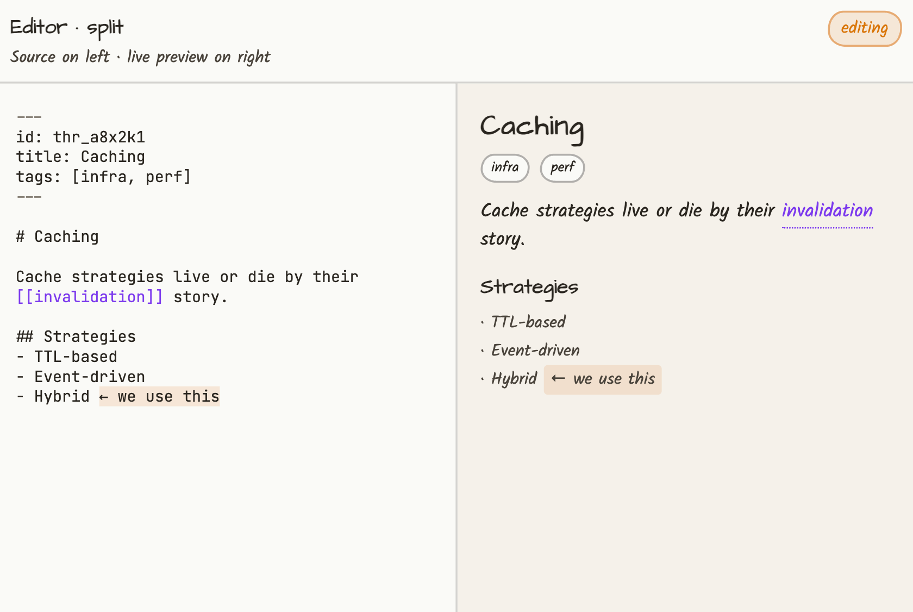<br />
      <sub><b>Editor</b> — split source/preview writing experience with wikilink autocomplete</sub>
    </td>
  </tr>
  <tr>
    <td align="center">
      <br />
      <sub><b>Inbox</b> — capture-to-note flow with Weaver suggestions for type, folder, tags, and links</sub>
    </td>
    <td align="center">
      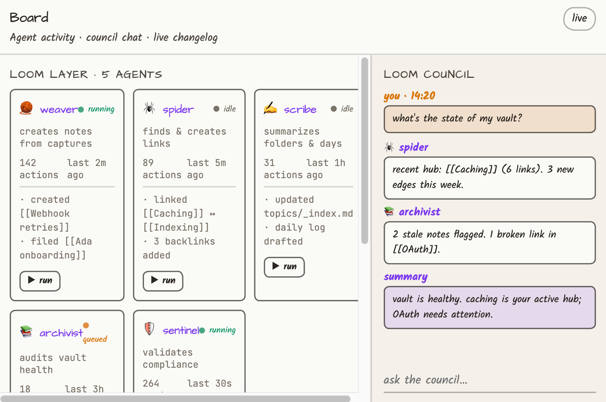<br />
      <sub><b>Board</b> — agent presence: cards and pulse modes with a live changelog</sub>
    </td>
  </tr>
  <tr>
    <td align="center">
      <br />
      <sub><b>Council</b> — transparent multi-agent thread where all five Loom Layer agents answer together</sub>
    </td>
    <td align="center">
      <br />
      <sub><b>Pulse</b> — live ECG-style heartbeats showing each agent's running / queued / idle state</sub>
    </td>
  </tr>
  <tr>
    <td align="center" colspan="2">
      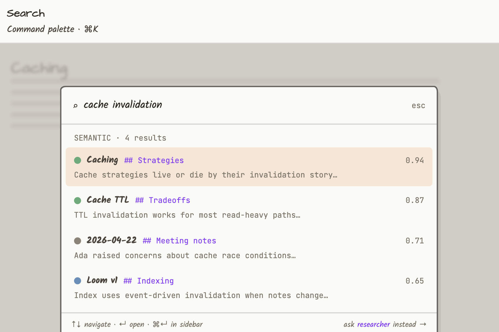<br />
      <sub><b>Search</b> — Cmd/Ctrl-K palette with hybrid semantic + keyword scoring across the vault</sub>
    </td>
  </tr>
</table>

## License

MIT — see [LICENSE](LICENSE).
